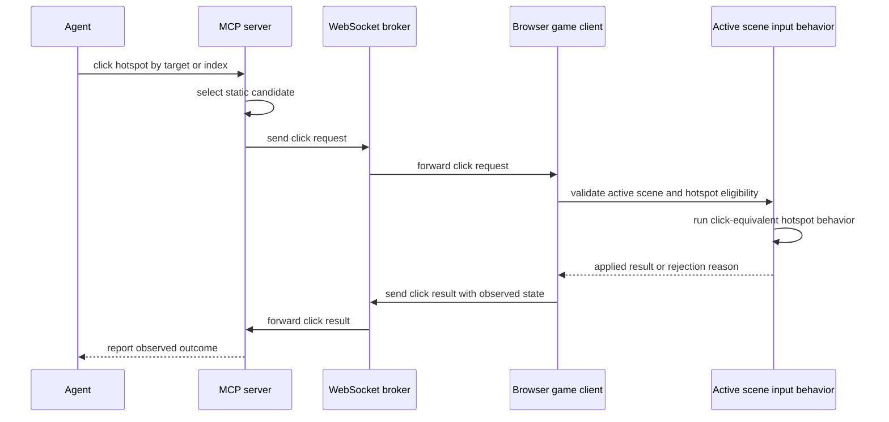

# Real Input Parity for Hotspot Clicks

## Summary

Implement the MVP hotspot-click harness by routing MCP click requests into the connected browser's active scene behavior, then reporting success or failure from observed browser/game state. Static map data may still help agents select a candidate hotspot, but the browser becomes the authority for eligibility, execution, and evidence.

---

## Problem Frame

The Morpheus harness currently has a WebSocket broker, MCP server, browser control hook, and static map query utilities, but hotspot click control is not yet equivalent to user interaction. The existing MCP click helper rotates toward a hotspot and directly loads a target scene, which can prove that a target scene exists but cannot prove that the browser accepted a legal click or preserved non-navigation hotspot behavior (see origin: `docs/brainstorms/2026-05-16-real-input-parity-requirements.md`).

---

## Requirements

- R1. A basic harness hotspot click must reach the active browser scene instead of directly substituting a scene load.
- R2. The browser-side click path must use the same hotspot existence and gamestate eligibility rules as the active scene input path.
- R3. Navigation hotspot success must be judged by observed browser/game state after the action.
- R4. Non-navigation hotspot clicks must preserve existing gamestate or scripted hotspot effects when the active scene input path supports them.
- R5. The MCP-facing result must distinguish interaction applied, no matching hotspot, hotspot inactive, no browser session connected, and browser did not reach the expected observed state.
- R6. The result must include enough state for an agent to decide what happened, including current scene ID and relevant browser-observed changes.
- R7. The harness must not claim click success solely because an MCP command was accepted or sent through the broker.
- R8. The implementation should leave a clear boundary for a future structured legal-action API.
- R9. The implementation should leave room for future pointer primitives without requiring them for this MVP.
- R10. Higher-level helpers such as path navigation should remain composed conveniences over trusted primitives, not substitutes for primitive validation.

**Origin actors:** A1 Agent operator, A2 MCP controller, A3 Browser game client, A4 Future planner/implementer

**Origin flows:** F1 Hotspot click through the harness, F2 Non-navigation hotspot handling, F3 Future precision interaction discovery

**Origin acceptance examples:** AE1 active navigation hotspot, AE2 active non-navigation hotspot, AE3 inactive hotspot, AE4 missing browser session, AE5 future precision control boundary

---

## Scope Boundaries

- Full pointer down/move/up/drag primitives are out of scope.
- A complete structured legal player-action API is out of scope.
- Screenshot, video, and rich artifact capture are out of scope beyond the minimal observed state needed to prove click behavior.
- Multi-client broker/session redesign is out of scope.
- Runtime protocol validation and full request/response correlation are out of scope, except for the minimum result semantics needed for hotspot click evidence.
- Production deployment support is out of scope; this remains a local-development harness capability.

### Deferred to Follow-Up Work

- Structured legal player-action API: expose inspectable legal moves after click parity proves the primitive interaction path.
- Pointer primitives: add coordinate clicks and drag paths only after the browser-side click result contract is reliable.
- Evidence artifacts: add screenshots or recordings after state-based evidence has a stable protocol shape.
- Path navigation hardening: update composed path tools to depend on trusted click results after the primitive click flow lands.

---

## Context & Research

### Relevant Code and Patterns

- `packages/www/server.ts` already brokers messages between one browser client and one MCP client per named local session. It currently forwards messages without acknowledgement or request correlation.
- `packages/www/src/lib/game-control-protocol.ts` defines `CLICK_HOTSPOT` from MCP to browser, but no browser-to-MCP click result message exists yet.
- `packages/www/src/morpheus-app/hooks/useGameControl.ts` parses `CLICK_HOTSPOT` and calls `onClickHotspot`, but the scene runtime does not pass that callback today.
- `packages/www/src/app/scene/stage-shell.tsx` owns active scene, transition, rotation, live state reporting, and the browser control hook. It currently wires load and rotate callbacks only.
- `packages/www/src/morpheus-app/components/InteractiveStage.tsx` owns the active rendered stage and calls `useInputHandler`, which is the natural browser-side boundary for click-equivalent hotspot execution.
- `packages/www/src/morpheus-app/hooks/useInputHandler.ts` already centralizes active hotspot filtering, click qualification, gamestate updates, scripted actions, and scene transitions.
- `packages/www/src/morpheus-app/hotspot/handleHotspotAction.ts` is the testable action engine for hotspot effects and should remain the source of truth for per-hotspot behavior.
- `packages/www/mcp-server/index.ts` currently implements `morpheus_click_hotspot` by rotating and directly sending `LOAD_SCENE` for navigation hotspots. That shortcut is the behavior this plan removes.
- `packages/www/mcp-server/map-query.ts` provides static scene/hotspot discovery and remains useful for candidate selection, but it cannot decide live gamestate eligibility.
- `packages/www/vitest.config.ts` currently includes `src/**/*.test.ts` and `src/**/*.test.tsx`, so browser-side tests should live under `packages/www/src/`.

### Institutional Learnings

- No `docs/solutions/` directory exists yet in this repo. This plan should treat the new requirements and plan docs as the first compound-engineering knowledge artifacts for this harness work.

### External References

- No external references are needed for the implementation approach. The harness behavior is custom, and the active Morpheus scene input path is the authoritative local pattern.

---

## Key Technical Decisions

- Use a browser-side action bridge instead of synthetic pointer events: literal DOM pointer synthesis would reintroduce fragile coordinate precision as the MVP dependency. A browser-owned click bridge can still run the same active hotspot action behavior while making legality and evidence observable.
- Keep MCP static map use as candidate selection only: static map data can find a hotspot by target scene or index, but the connected browser must validate active scene, active gamestate, and actual result.
- Add a minimal click result protocol rather than a full request/response spine: the MVP needs a bounded result for one command, not a general correlation framework. The result should still be shaped so future correlation can wrap it without replacing the semantics.
- Extract shared click-equivalent behavior before wiring the command path: the implementation should avoid duplicating hotspot filtering/action logic in the harness callback.
- Preserve non-navigation behavior as a first-class verification target: a plan that only proves scene navigation would leave the old shortcut effectively intact.

---

## Open Questions

### Resolved During Planning

- Should the MVP use synthetic browser pointer events, a shared scene-input helper, or a browser-side action bridge? Use a browser-side action bridge into shared hotspot behavior so click parity does not depend on fragile screen-coordinate simulation.
- What is the smallest result envelope? A command-specific click result that reports outcome, current scene ID, optional expected target scene ID, matched hotspot details, and observed gamestate/scene changes is enough for the MVP.
- Where should the future legal-action API boundary sit? After browser-owned primitive validation. Legal actions can later enumerate and execute the same active-scene capabilities without depending on pointer precision.

### Deferred to Implementation

- Which exact navigation and non-navigation scenes become fixtures: select deterministic scenes while implementing tests, using `morpheus_get_scene_info`, static map data, and active scene fixtures to avoid brittle assumptions.
- Whether the click result needs a caller-provided command ID immediately: this plan does not require full correlation, but the implementing agent may include a simple optional ID if it materially simplifies waiting for the result without broadening the protocol.

---

## High-Level Technical Design

> *This illustrates the intended approach and is directional guidance for review, not implementation specification. The implementing agent should treat it as context, not code to reproduce.*

---

## Implementation Units

### U1. Define the Minimal Click Result Contract

**Goal:** Add the protocol shape needed for browser-owned hotspot click results without implementing a general request/response framework.

**Requirements:** R3, R5, R6, R7, R8, R9

**Dependencies:** None

**Files:**
- Modify: `packages/www/src/lib/game-control-protocol.ts`
- Test: `packages/www/src/lib/game-control-protocol.test.ts`

**Approach:**
- Extend the protocol with a browser-to-MCP click result message that reports a finite outcome set, current observed scene ID, optional expected target scene ID, optional matched hotspot metadata, and relevant observed changes.
- Keep the MCP-facing outcome vocabulary focused on the requirements: applied, no matching hotspot, inactive hotspot, no browser session connected, and expected observed state not reached. The no-browser-session outcome is produced by the MCP side when no browser can answer; it does not require a browser-originated message.
- Use explicit TypeScript unions instead of unstructured strings or `any`-shaped payloads.

**Execution note:** Test-first for the result outcome typing and parse/serialize round-trip.

**Patterns to follow:**
- Existing message unions and helpers in `packages/www/src/lib/game-control-protocol.ts`.
- Strict TypeScript guidance in `AGENTS.md` and `packages/www/AGENTS.md`.

**Test scenarios:**
- Happy path: serializing and parsing an applied click result preserves outcome, scene ID, matched hotspot, and observed changes.
- Error path: serializing and parsing each browser-originated failure outcome preserves the reason without requiring optional success-only fields.
- Error path: MCP-facing result helpers can represent a missing browser session without pretending it came from the browser.
- Edge case: protocol parsing still returns `null` for invalid JSON and malformed objects.

**Verification:**
- The protocol exposes a typed result message that can distinguish all MVP outcomes without broad protocol redesign.

---

### U2. Extract Browser-Side Click-Equivalent Hotspot Behavior

**Goal:** Make the active scene input path callable by a harness click command without duplicating hotspot eligibility or action semantics.

**Requirements:** R1, R2, R4, R5, R8, R9

**Dependencies:** U1

**Files:**
- Modify: `packages/www/src/morpheus-app/hooks/useInputHandler.ts`
- Modify: `packages/www/src/morpheus-app/hotspot/handleHotspotAction.ts`
- Create: `packages/www/src/morpheus-app/hotspot/harnessClick.ts`
- Test: `packages/www/src/morpheus-app/hotspot/harnessClick.test.ts`

**Approach:**
- Extract a small, typed helper that can find a hotspot by cast ID in the active scene, verify it is currently active, choose a click-equivalent position from the hotspot bounds, and invoke the same action machinery used by pointer clicks.
- Keep pano coordinate math and drag behavior out of this helper. The MVP action is a hotspot click, not a coordinate-level pointer primitive.
- Return a browser-local result that the stage can translate into the protocol result after it has observed scene and gamestate changes.

**Execution note:** Characterization-first around existing click behavior before changing the hook. The helper should prove that a MouseClick hotspot and a MouseUp hotspot flow through the same action semantics as current pointer handling where applicable.

**Patterns to follow:**
- Active hotspot filtering in `packages/www/src/morpheus-app/hooks/useInputHandler.ts`.
- Action execution in `packages/www/src/morpheus-app/hotspot/handleHotspotAction.ts`.
- Matchers in `packages/www/src/morpheus-app/hotspot/matchers.ts`.

**Test scenarios:**
- Happy path: active MouseClick navigation hotspot by cast ID returns an applied result and a scene transition request.
- Happy path: active non-navigation hotspot that increments or sets gamestate returns applied and records the expected gamestate update.
- Error path: missing cast ID returns no matching hotspot and does not invoke action handling.
- Error path: present but inactive hotspot returns inactive hotspot and does not invoke action handling.
- Edge case: a hotspot with wraparound horizontal bounds can still be matched by its derived click-equivalent position.

**Verification:**
- The browser has a testable click-equivalent hotspot action that shares current scene eligibility and hotspot action semantics.

---

### U3. Wire Browser Command Handling Through the Active Stage

**Goal:** Connect `CLICK_HOTSPOT` from the browser control hook to the active rendered scene and return an observed result to MCP.

**Requirements:** R1, R2, R3, R4, R5, R6, R7

**Dependencies:** U1, U2

**Files:**
- Modify: `packages/www/src/morpheus-app/hooks/useGameControl.ts`
- Modify: `packages/www/src/app/scene/stage-shell.tsx`
- Modify: `packages/www/src/morpheus-app/components/InteractiveStage.tsx`
- Test: `packages/www/src/morpheus-app/hooks/useGameControl.test.ts`
- Test: `packages/www/src/morpheus-app/hotspot/harnessClick.test.ts`

**Approach:**
- Let `InteractiveStage` expose or accept a stable browser-side click command bridge tied to the current active scene, gamestates, and transition callback.
- Have `stage-shell` pass `onClickHotspot` into `useGameControl` and translate the stage result into the protocol result after observing current scene state.
- Preserve the existing load, rotate, current-state, and WebSocket status behavior.
- Avoid adding a global store slice unless implementation shows that callback ownership becomes unreasonably tangled.

**Patterns to follow:**
- Current callback wiring for load and rotate in `packages/www/src/app/scene/stage-shell.tsx`.
- Live state getter shape in `packages/www/src/morpheus-app/hooks/useGameControl.ts`.
- `InteractiveStage` ownership of `useInputHandler`.

**Test scenarios:**
- Integration: receiving `CLICK_HOTSPOT` with a valid active cast ID calls the browser click bridge and sends an applied result.
- Error path: receiving `CLICK_HOTSPOT` before stage state is available sends a failure result rather than silently doing nothing.
- Integration: navigation click result is reported only after the observed scene matches the expected target or a bounded wait reports expected state not reached.
- Integration: non-navigation click result includes observed gamestate changes when available and does not require a target scene.
- Regression: `LOAD_SCENE`, `ROTATE_TO`, `GET_STATE`, and `PING` behavior remains unchanged.

**Verification:**
- A connected browser session can receive a hotspot click command, apply or reject it through the active stage, and send an evidence-bearing result.

---

### U4. Update MCP Click Tool to Trust Browser Results

**Goal:** Replace direct scene-load shortcut behavior in `morpheus_click_hotspot` with a browser-validated click request and result wait.

**Requirements:** R1, R2, R3, R5, R6, R7, R10

**Dependencies:** U1, U3

**Files:**
- Modify: `packages/www/mcp-server/index.ts`
- Modify: `packages/www/mcp-server/map-query.ts`
- Modify: `packages/www/vitest.config.ts`
- Create: `packages/www/mcp-server/click-hotspot-tool.ts`
- Test: `packages/www/mcp-server/click-hotspot.test.ts`

**Approach:**
- Keep static map lookup for selecting a candidate by target scene ID or hotspot index.
- Send `CLICK_HOTSPOT` with the selected cast ID and expected target metadata instead of sending `LOAD_SCENE`.
- Wait for the browser click result and format the MCP tool response from the browser-observed outcome.
- Detect the missing browser-session case before waiting when the broker connection cannot be established or no result arrives within a bounded timeout.
- Leave `morpheus_rotate_to_hotspot` unchanged as a viewing helper; it should not be treated as click evidence.

**Execution note:** Test the click tool behavior without requiring a real browser by isolating candidate selection, message send, and result handling behind small typed helpers.

**Patterns to follow:**
- Existing `pendingStateRequest` pattern in `packages/www/mcp-server/index.ts`, but keep the new click wait separate so state requests and click requests cannot overwrite each other.
- Static candidate selection in the current `morpheus_click_hotspot` implementation.

**Test scenarios:**
- Happy path: target-scene click sends `CLICK_HOTSPOT`, waits for applied browser result, and reports observed scene success.
- Happy path: non-navigation click sends `CLICK_HOTSPOT`, waits for applied browser result, and reports observed state changes without sending `LOAD_SCENE`.
- Error path: no browser connection returns a missing browser-session error.
- Error path: browser result says no matching hotspot or inactive hotspot, and the MCP response surfaces that exact outcome.
- Error path: expected target scene is not reached before timeout, and the MCP response does not claim success.
- Regression: the click tool no longer sends `LOAD_SCENE` as part of hotspot click execution.

**Verification:**
- MCP click responses are derived from browser click results, not from command-send success or direct scene loading.

---

### U5. Add Deterministic Harness Verification Fixtures

**Goal:** Establish repeatable coverage for active navigation, non-navigation, inactive, and missing-browser click outcomes.

**Requirements:** R2, R3, R4, R5, R6, R7

**Dependencies:** U2, U3, U4

**Files:**
- Create: `packages/www/src/morpheus-app/hotspot/harnessClick.fixtures.ts`
- Modify: `packages/www/src/morpheus-app/hotspot/harnessClick.test.ts`
- Modify: `packages/www/mcp-server/click-hotspot.test.ts`

**Approach:**
- Start with small fixture scenes/hotspots instead of full asset-heavy browser tests for the unit and integration layers.
- Include one fixture for a navigation hotspot, one for a gamestate-changing non-navigation hotspot, and one inactive hotspot with comparators.
- Use live map data only where it adds confidence without making tests brittle; fixture tests should remain the core proof.

**Patterns to follow:**
- Existing Vitest setup in `packages/www/vitest.config.ts`.
- Existing storage test style in `packages/www/src/morpheus-app/storage/gamestateStorage.test.ts`.
- MCP server source location under `packages/www/mcp-server/`; the test runner should explicitly include that surface when MCP helper tests are added.

**Test scenarios:**
- Happy path: navigation fixture transitions to the expected scene and reports the observed scene ID.
- Happy path: non-navigation fixture mutates gamestate and reports the relevant changed state.
- Error path: inactive fixture is rejected before action handling.
- Error path: missing browser or timeout fixture produces a non-success MCP result.
- Edge case: fixture candidate selected by target scene and by hotspot index both resolve to the same browser-validated click path.

**Verification:**
- A future implementer can run focused tests that prove the primitive click behavior without relying on manual Cursor/browser sessions.

---

### U6. Refresh Harness Documentation and Future Boundaries

**Goal:** Document the new click semantics, verification expectations, and deferred action surfaces so future agents do not reintroduce shortcut behavior.

**Requirements:** R6, R7, R8, R9, R10

**Dependencies:** U4, U5

**Files:**
- Modify: `AGENTS.md`
- Modify: `packages/www/AGENTS.md`
- Modify: `packages/www/test-mcp-tools.md`
- Create: `docs/solutions/2026-05-16-morpheus-hotspot-click-parity.md`
- Test expectation: none -- documentation-only unit; rely on `git diff --check` and the implementation tests from U1-U5.

**Approach:**
- Update agent-facing docs so `morpheus_click_hotspot` is described as browser-validated, not as rotate-and-load.
- Document that `morpheus_rotate_to_hotspot` is a viewing helper, not proof of interaction.
- Capture the compound learning: browser state is authoritative for legal interaction; static map data is candidate discovery.
- Record the deferred boundaries for structured legal actions and pointer primitives.

**Patterns to follow:**
- Existing MCP workflow notes in `AGENTS.md` and `packages/www/AGENTS.md`.
- Existing manual MCP test notes in `packages/www/test-mcp-tools.md`.

**Test scenarios:**
- Test expectation: none -- documentation-only changes should be reviewed for consistency with the implemented behavior.

**Verification:**
- Agent instructions and test notes match the new browser-authoritative click behavior.

---

## System-Wide Impact

- **Interaction graph:** MCP click requests flow through the broker to the browser control hook, then into the active stage/input behavior before a result flows back to MCP.
- **Error propagation:** Browser-owned rejection reasons should be surfaced as MCP tool errors or non-success results with enough state for the agent to recover.
- **State lifecycle risks:** Navigation clicks are asynchronous because transitions and scene readiness already involve pending scenes. The click result must not be emitted as success before the browser observes the target state or reaches a bounded failure.
- **API surface parity:** `morpheus_click_hotspot` becomes the trusted primitive; higher-level path navigation should eventually compose it rather than sending direct scene loads.
- **Integration coverage:** Unit tests can prove most behavior, but a manual named-session smoke test remains useful after implementation because the broker and browser runtime are local-dev surfaces.
- **Unchanged invariants:** `morpheus_load_scene` remains a direct scene-load command for explicit agent requests. The change is that hotspot click helpers must not use direct load as fake click proof.

---

## Risks & Dependencies

| Risk | Mitigation |
|------|------------|
| The bridge drifts from real user click semantics | Extract and reuse the same active hotspot filtering and action handling used by `useInputHandler`; characterize before refactoring. |
| Navigation result is reported too early | Treat transition completion or observed current scene state as the success condition, with timeout reported as failure. |
| Non-navigation behavior remains under-tested | Include fixture coverage for gamestate-changing hotspot actions, not only scene transitions. |
| Minimal click result becomes an accidental full correlation framework | Keep the result command-specific and defer general request/response correlation to follow-up work. |
| MCP tests are hard to write because the server entry point is monolithic | Extract small typed helpers only where needed for candidate selection and result waiting; avoid broad server refactors. |
| Static map candidate and live browser state disagree | Browser result wins. MCP should report the disagreement rather than forcing the static candidate through. |

---

## Documentation / Operational Notes

- Run browser-control work through the local custom dev server, not the plain Next dev server, because the WebSocket broker lives in `packages/www/server.ts`.
- Preserve Yarn classic and Lerna workspace conventions; do not change package manager or introduce new build surfaces.
- Keep all new TypeScript strict and avoid `any`, unsafe casts, and broad compatibility shims.
- After implementation, the manual smoke workflow should open a named browser session, connect MCP to the same session, click a known navigation hotspot, click a known non-navigation hotspot, and confirm the reported outcomes match observed state.

---

## Alternative Approaches Considered

- Literal synthetic pointer events first: rejected for the MVP because the user already observed precision limits around intricate touch and drag behavior. It also makes the lowest milestone depend on the hardest coordinate problem.
- Keep direct scene-load shortcut for navigation hotspots: rejected because it violates the core evidence requirement and cannot cover non-navigation hotspots.
- Build the structured legal-action API first: deferred because click parity is the smallest useful primitive proof, while legal actions deserve their own design after the browser-authoritative action boundary is in place.
- Full request/response correlation now: deferred because the MVP needs command-specific click evidence, not a general protocol redesign.

---

## Success Metrics

- `morpheus_click_hotspot` no longer sends `LOAD_SCENE` to simulate a click.
- Active navigation hotspots report success only after observed browser state reaches the expected scene.
- Active non-navigation hotspots can report applied gamestate or scripted effects without requiring a target scene.
- Missing, inactive, disconnected, and timeout cases return distinct actionable outcomes.
- Agent-facing docs describe static map data as candidate discovery and browser state as the source of truth.

---

## Sources & References

- **Origin document:** [docs/brainstorms/2026-05-16-real-input-parity-requirements.md](../brainstorms/2026-05-16-real-input-parity-requirements.md)
- Related code: `packages/www/src/lib/game-control-protocol.ts`
- Related code: `packages/www/server.ts`
- Related code: `packages/www/mcp-server/index.ts`
- Related code: `packages/www/mcp-server/map-query.ts`
- Related code: `packages/www/src/morpheus-app/hooks/useGameControl.ts`
- Related code: `packages/www/src/app/scene/stage-shell.tsx`
- Related code: `packages/www/src/morpheus-app/components/InteractiveStage.tsx`
- Related code: `packages/www/src/morpheus-app/hooks/useInputHandler.ts`
- Related code: `packages/www/src/morpheus-app/hotspot/handleHotspotAction.ts`
- Related code: `packages/www/src/morpheus-app/hotspot/matchers.ts`
- Related code: `packages/www/src/morpheus-app/hotspot/handlers.ts`
- Related docs: `packages/www/AGENTS.md`
- Related docs: `packages/www/test-mcp-tools.md`
