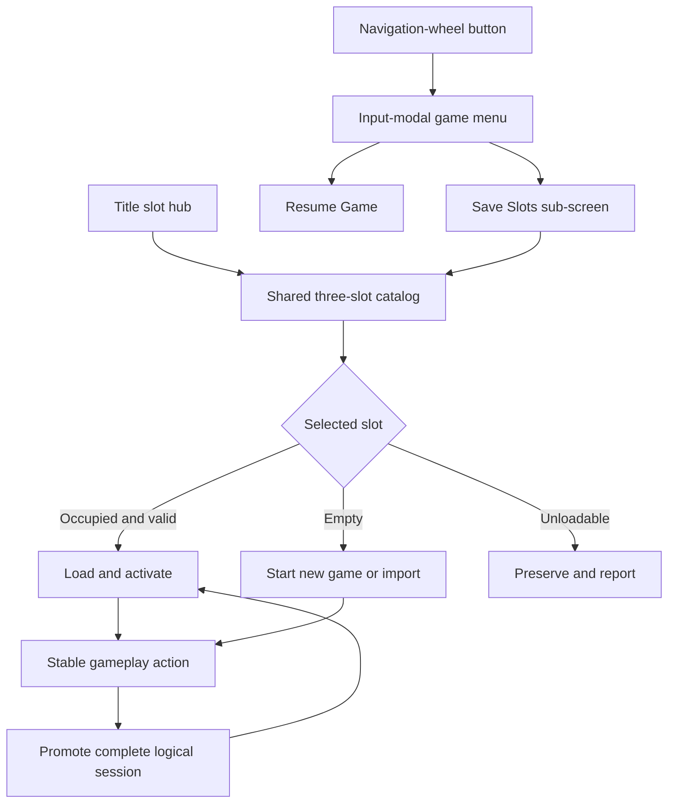
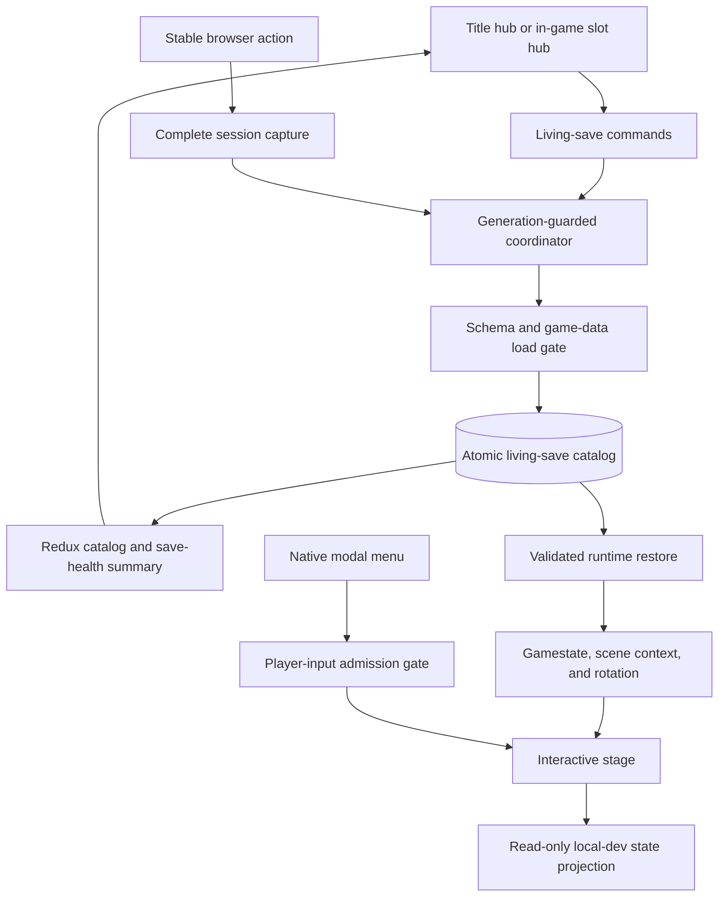
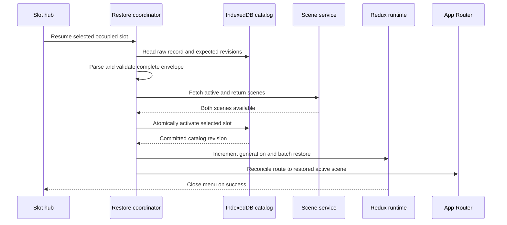
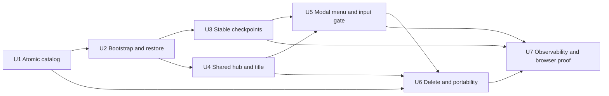

# Morpheus Living Saves and In-Game Menu - Plan

## Goal Capsule

- **Objective:** Make Morpheus progress survive reloads through three player-visible living save slots, with honest loading from the title screen and a minimal navigation-wheel menu during play.
- **Product authority:** This Product Contract governs user-facing behavior; Morpheus-C++ establishes original whole-session save semantics; Morpheus-javascript provides reference menu and file-save behavior; the TypeScript browser runtime remains authoritative for observable state.
- **Execution profile:** Deep implementation across browser persistence, Redux runtime coordination, title and menu UI, pointer-input ownership, and local-dev observability.
- **Stop conditions:** Stop if implementation would delete legacy browser data, hydrate any unvalidated partial session, make a scene URL outrank a valid active slot, or require a gameplay save overlay or global authored-world pause.
- **Tail ownership:** The implementing agent owns automated checks, real-browser desktop and touch validation, named-session MCP evidence, and post-implementation Compound Engineering code review.
- **Open blockers:** None. The planning-deferred questions in the Product Contract are resolved by the Planning Contract below.

---

## Product Contract

### Summary

Morpheus will provide three fixed browser-local living save slots that automatically persist coherent logical sessions and survive reloads.
Players will manage the same slots from the title screen and from a minimal modal menu opened by the top-left navigation-wheel button.

### Problem Frame

The TypeScript runtime keeps recent gamestate changes in Redux until a later scene transition writes them.
A reload before that transition can discard puzzle progress even though the game appeared to accept it.

The persisted history does not restore the complete playable place.
Scene context and panorama position live separately, while the title offers only a destructive New Game path.

The TypeScript runtime also lacks the conventional in-game menu that previously contained save, load, settings, and utility actions.
That missing boundary matters in a pointer-driven game: menu interaction must not also rotate a panorama, move a slider, or activate a hotspot.

Morpheus-javascript demonstrates the intended whole-session payload and conventional menu shape, although its browser-load path is not reliable enough to be the behavioral authority.
Morpheus-C++ remains the stronger source for whole-session restoration semantics.

### Key Decisions

- **Persist coherent logical sessions** (session-settled: user-directed — chosen over scene-only, idle-timer, and exact-frame checkpoints: recent logical progress should survive reload without recording transient presentation state). A stable state-changing action promotes one complete resume point containing gamestate, navigation context, and panorama position.
- **Use three fixed living slots** (session-settled: user-directed — chosen over automatic forks, immutable checkpoints, and unlimited history: players who want alternate timelines can manage the three slots themselves). Loading a slot makes it active, and later autosaves update that slot.
- **Reuse one slot hub** (session-settled: user-directed — chosen over separate title and in-game save-management flows: players should learn one surface). The hub is the title's primary Continue or New Game choice and a Save Slots sub-screen inside the in-game menu.
- **Use a minimal navigation-wheel menu** (session-settled: user-directed — chosen over including Settings, Reload, Return to Title, or other legacy utilities in this slice: save/load needs a trustworthy in-game home without expanding into a general menu redesign). The top level contains only Resume Game and Save Slots.
- **Make the menu input-modal, not world-pausing** (session-settled: user-directed — chosen over pausing all authored activity or delaying the menu until the world is stable: blocking player input is sufficient and simpler). Movies, transitions, timers, and eligible autosaves may continue while the menu is open.
- **Dismiss without leaking input** (session-settled: user-directed — chosen over a close control as the only exit: the menu should leave play quickly). Resume Game, Escape, the navigation-wheel button, or an outside click closes the menu; the closing input cannot also affect the game world.
- **Use one reversible deletion model** (session-settled: user-directed — chosen over overwrite commands and confirmation dialogs: players should not navigate a second replacement flow). Mobile reveals Delete by swiping left, desktop exposes a trash action, and deletion offers Undo.
- **Ship an honest v1 load gate** (session-settled: user-approved — chosen over silent reset and a full repair product: invalid data must not enter live play, but migration and repair tooling can follow later). V1 validates supported saves and preserves invalid or unsupported slots as unloadable.
- **Include per-slot export and import** (session-settled: user-approved — chosen over local-only delivery and whole-catalog backup: portable files provide immediate testing value without catalog-level restore complexity). Imports target empty slots and pass the same load gate as local resumes.
- **Keep save failures off the game canvas** (session-settled: user-directed — chosen over pausing play or adding a gameplay overlay: save health must not obscure regular play). The menu reports save health while the last durable session remains authoritative.
- **Preserve coherence without prescribing switch timing** (session-settled: user-directed — chosen over requiring either wait-for-completion or forced abandonment: the simpler implementation is acceptable if no hybrid action becomes durable). A switch may let an unsettled event finish or restore the last durable session.



The title and in-game menu share one catalog.
An occupied valid slot activates a living timeline, an empty slot starts or imports one, and an unloadable slot remains preserved without entering live play.

### Requirements

**Durable logical sessions**

- R1. Each occupied slot must contain a self-contained, versioned logical session with gamestate, active scene, semantic previous or return context, and panorama position.
- R2. A state-changing gameplay action must become eligible for persistence once its logical outcome can resume coherently.
- R3. A completed scene transition must make either the prior coherent session or the ready destination session durable, never an intermediate combination.
- R4. The game must promote a complete session as one authoritative resume point so reload cannot observe a partially updated checkpoint.
- R5. Reload must restore the active slot's logical session and derive scene presentation from that restored truth.
- R6. Transient movie frames, animation progress, pointer gestures, and open-menu state must not become part of the durable session.

**Living slot catalog and title**

- R7. The game must expose exactly three fixed living slots, with at most one active slot at a time.
- R8. Loading an occupied slot must make it active and direct later stable-action autosaves into that slot.
- R9. Starting a game in an empty slot must use the established intro and new-game flow without clearing either other slot.
- R10. The title must present the three-slot hub as its primary Continue or New Game surface.
- R11. Each slot card must identify its occupied, empty, saving, saved, save-unavailable, or unloadable state.

**Navigation-wheel menu and input boundary**

- R12. Active gameplay must expose a top-left navigation-wheel button that opens a conventional modal menu.
- R13. The menu's top level must contain only Resume Game and Save Slots.
- R14. Save Slots must open the same three-slot hub used by the title and identify the active slot.
- R15. An open menu must own pointer, keyboard, touch, and focus so panorama drags, sliders, hotspots, and other player input cannot also react.
- R16. Opening the menu must not pause authored movies, transitions, timers, or otherwise eligible autosaves for the current active slot.
- R17. Resume Game, Escape, the navigation-wheel button, or an outside click must close the menu.
- R18. An input that closes the menu must be consumed and must not activate the underlying game.
- R19. Save health and retry affordances must appear inside the menu without adding persistence chrome to regular gameplay.

**Loading and switching**

- R20. Selecting an occupied slot must validate its complete session before any part of it mutates live game state.
- R21. Selecting another occupied slot from the menu must switch timelines without persisting or restoring a half-action.
- R22. The switch flow must not require a separate autosave, overwrite choice, or routine confirmation.
- R23. Normal autosaves may continue for the current active slot until another slot is successfully activated.

**Deletion and new games**

- R24. Mobile slot cards must reveal Delete through a left-swipe action, while desktop slot cards must expose a trash action.
- R25. Deleting a slot must empty only that slot and offer a brief Undo path without opening a confirmation dialog.
- R26. Starting another game when all three slots are occupied must require the player to delete a slot first.
- R27. The game must not offer a separate overwrite, Replace This Slot, or global replacement flow.

**Per-slot portability**

- R28. An occupied slot must export as one portable file containing the same complete logical session used for local resume.
- R29. An exported file must carry enough format identity to pass the load gate before it can affect a local slot.
- R30. Import must target an empty slot and must not silently replace an occupied slot.
- R31. A successful import must create an occupied living slot that can continue like a locally created slot.
- R32. A failed import must leave the target slot, the other slots, and live game state unchanged.

**Failure and compatibility**

- R33. A persistence failure must leave the last durable version of the active slot intact while allowing gameplay to continue with newer volatile state.
- R34. Invalid, corrupt, unavailable-scene, or unsupported-version slot data must remain preserved and visibly unloadable rather than being erased or treated as a new game.
- R35. An unloadable slot may be deleted through the normal reversible deletion flow but must not be partially hydrated.
- R36. Multiple browser contexts must not be able to corrupt a slot or promote conflicting partial sessions.

### Key Flows

- F1. Start a new living timeline
  - **Trigger:** The player selects an empty card from the title hub or the in-game Save Slots screen.
  - **Steps:** The game activates that slot, runs the established intro and new-game flow, and promotes the first stable logical session.
  - **Outcome:** One slot becomes occupied and active without changing the other two.
  - **Covers:** R7-R10, R26-R27.
- F2. Continue a saved timeline
  - **Trigger:** The player selects an occupied card from the title hub.
  - **Steps:** The load gate validates the slot, restores its logical session, derives presentation, and marks the slot active.
  - **Outcome:** Play resumes in the saved authored context and later autosaves update the selected slot.
  - **Covers:** R1, R5, R8, R20.
- F3. Open and close the in-game menu
  - **Trigger:** The player selects the top-left navigation-wheel button.
  - **Steps:** The menu takes input ownership while authored world activity may continue; Resume Game, Escape, the button, or an outside click closes it.
  - **Outcome:** No menu gesture also rotates, drags, or activates the game world.
  - **Covers:** R12-R19.
- F4. Switch slots in game
  - **Trigger:** The player opens Save Slots and selects another occupied card.
  - **Steps:** The runtime preserves a coherent boundary, validates the target slot, activates it, and redirects later autosaves.
  - **Outcome:** The selected timeline replaces the current one without a separate autosave or confirmation.
  - **Covers:** R14, R20-R23.
- F5. Delete and start over
  - **Trigger:** The player reveals Delete by swiping left on mobile or chooses the trash action on desktop.
  - **Steps:** The slot becomes empty, Undo remains temporarily available, and the empty card offers New Game or Import.
  - **Outcome:** A new timeline can start through the one reversible replacement model.
  - **Covers:** R24-R27, R35.
- F6. Export and import a slot
  - **Trigger:** The player exports an occupied slot or chooses Import on an empty card.
  - **Steps:** Export produces one self-contained file; import validates the file before creating the target slot.
  - **Outcome:** A portable slot round-trips into a playable timeline without replacing existing slots.
  - **Covers:** R28-R32.
- F7. Continue after a save or load failure
  - **Trigger:** A checkpoint cannot become durable or a slot fails validation.
  - **Steps:** Gameplay continues from the current volatile state or the prior durable state, while the menu or slot card reports the truthful failure state.
  - **Outcome:** The game neither blocks play nor claims that invalid or volatile progress is safely resumable.
  - **Covers:** R11, R19, R33-R35.

### Acceptance Examples

- AE1. **Covers R1-R5.** Given an occupied slot in scene `105049`, when a state-changing slider action settles and the page reloads, then restored gamestate selects the correct derived imagery without resuming a transient drag or movie frame.
- AE2. **Covers R1-R5.** Given a non-default panorama position in scene `1050`, when a stable action is saved and the page reloads, then the slot resumes the saved scene and panorama context.
- AE3. **Covers R3-R4.** Given a reload interrupts a scene transition, when the game starts again, then it restores either the prior committed scene or the complete ready destination and never a hybrid.
- AE4. **Covers R7-R11, R20-R23.** Given two occupied slots with different scenes and gamestates, when the player switches between them and continues playing, then each slot retains its own timeline and only the active slot advances.
- AE5. **Covers R12-R18.** Given the menu is open over a panorama, slider, or hotspot, when the player drags, presses Escape, or clicks outside, then the menu handles or consumes the input and the underlying control does not react.
- AE6. **Covers R15-R16, R23.** Given an authored movie or stable autosave is in progress when the menu opens, when it completes without another slot being activated, then it may finish normally and update only the current active slot.
- AE7. **Covers R9, R26-R27.** Given all three slots are occupied, when the player wants a new game, then no New Game or Replace action bypasses the delete-first flow.
- AE8. **Covers R24-R25.** Given an occupied or unloadable slot, when the player deletes it through swipe-left on mobile or the trash action on desktop and chooses Undo, then the same slot data returns without a confirmation dialog.
- AE9. **Covers R28-R32.** Given an exported occupied slot and an empty target slot, when the file is imported, then the target becomes a playable copy with equivalent logical state and the other slots remain unchanged.
- AE10. **Covers R29-R32, R34-R35.** Given a malformed or unsupported file, when import is attempted, then no slot or live state changes and the file is not partially hydrated.
- AE11. **Covers R19, R33.** Given browser persistence fails after a stable action, when play continues, then no gameplay overlay appears, the menu reports Save unavailable, and reload returns to the prior durable session.
- AE12. **Covers R20, R34-R35.** Given an existing slot contains corrupt or unsupported data, when the title or Save Slots hub opens, then the slot remains represented as unloadable and is not silently reset.
- AE13. **Covers R36.** Given the same slot is open in two browser contexts, when both attempt to progress, then the catalog remains coherent and cannot expose a partial mixed checkpoint.

### Success Criteria

- A real browser mutation followed by reload restores the observed gamestate, scene, and panorama context rather than only passing a storage-unit test.
- Each slot can independently start, continue, autosave, switch, delete, undo, export, import, and survive reload.
- Transition interruption, persistence failure, invalid import, unsupported local data, and concurrent access never produce a partially restored session.
- Browser interaction proves that the open menu captures desktop and mobile input while underlying world controls remain unchanged.
- Desktop and mobile validation proves the shared title/menu slot hub, trash/swipe deletion, and absence of a regular-gameplay save overlay.

### Scope Boundaries

**Included**

- Three browser-local living slots with stable-action autosave.
- Complete logical-session resume and an honest v1 load gate.
- Shared title and in-game Save Slots hub.
- Top-left navigation-wheel button and minimal input-modal menu.
- Reversible delete-first slot management.
- Per-slot file export and import.
- Menu-only save health and retry.

**Deferred for later**

- Rich migration tooling, repair workflows, and export of damaged local data.
- Whole-catalog backup and restore.
- Settings, Help, Return to Title, Reload, and other menu destinations.
- Named or unlimited slots, automatic branching, replay history, and checkpoint timelines.
- Cloud sync, accounts, and cross-device conflict resolution.

**Outside this slice**

- Persisting exact movie frames, animation progress, pointer gestures, or open-menu state.
- Pausing the authored world merely because the menu is open.
- Adding save-status overlays or other persistence chrome to normal gameplay.
- Manual Save Now, overwrite, Replace This Slot, or timewarp/checkpoint controls.
- Preserving or relocating access to the existing debug settings surface.

### Dependencies and Assumptions

- The browser runtime remains the authority for active scene and gamestate outcomes.
- Morpheus remains a local single-player experience even when multiple browser contexts exist.
- Scene presentation can be deterministically derived from the restored logical session.
- The established intro and new-game flow remains intact after an empty slot is selected.
- Browser storage remains fallible and origin-bound; per-slot files are the portability boundary for this slice.
- The navigation-wheel menu can block player input without requiring authored media and transition systems to share a global pause state.

### Outstanding Questions

**Deferred to planning**

- Which gameplay outcomes constitute stable-action autosave boundaries.
- Whether a slot switch lets an unsettled action finish or restores the last durable session.
- How one active writer is enforced when the same slot is open in multiple browser contexts.
- Whether existing TypeScript single-history data can safely upgrade into Slot 1.
- Which compact slot-card metadata best distinguishes timelines.

### Sources and Research

- `docs/ideation/2026-07-18-morpheus-local-saves-game-menu-ideation.html` — ranked source ideation and the original six concepts.
- `packages/www/src/morpheus-app/store/slices/gamestateSlice.ts` — current pending-update and transition-commit behavior.
- `packages/www/src/morpheus-app/storage/gamestateStorage.ts` — current split entry and metadata persistence.
- `packages/www/src/morpheus-app/storage/types.ts` — current single-history persisted shape.
- `packages/www/src/morpheus-app/hooks/useGamestateHistory.ts` — current values-only hydration.
- `packages/www/src/morpheus-app/store/slices/sceneSlice.ts` and `packages/www/src/morpheus-app/store/slices/rotationSlice.ts` — independent scene and panorama state.
- `packages/www/src/app/client.tsx` — current title and destructive New Game behavior.
- `packages/www/src/app/scene/stage-shell.tsx` — transition and browser-observed interaction boundaries.
- `upstream/master:packages/morpheus/client/js/morpheus/game/components/MenuButton.tsx` and `upstream/master:packages/morpheus/client/js/morpheus/game/components/MenuList.tsx` — Morpheus-javascript's top-left button and conventional menu.
- `upstream/master:packages/morpheus/client/js/morpheus/game/actions.ts` — Morpheus-javascript's whole-session save payload and internally inconsistent browser-load path.
- `MorpheusWin/CommonSources/MorpheusSupport/CGameState.cpp` — Morpheus-C++ whole-session write and read semantics.

---

## Planning Contract

The Product Contract is unchanged.
This section resolves its implementation questions and defines the technical boundary for execution.

### Key Technical Decisions

- KTD1. **Use a new living-save database and leave the current history database untouched** (session-settled: user-approved — chosen over upgrading incomplete delta history into Slot 1: the old records lack enough scene, return, and rotation context to pass the complete-session load gate). Add `morpheus_living_saves` as the only persistence authority for the three-slot product. Keep `morpheus_gamestate` readable and unmodified for possible future recovery work, but remove its hydration, `clearAll`, and browser-history timewarp behavior from the player path.
- KTD2. **Store the complete three-slot catalog as one atomically replaced IndexedDB record.** The record has one fixed key, a catalog format/version, a monotonically increasing catalog revision, one active slot ID or `null`, exactly three stable slot keys, and bounded per-slot deletion tombstones. Every create, activate, checkpoint, delete, undo, and import mutation performs read, revision comparison, and replacement inside one `readwrite` transaction and reports success only from `transaction.oncomplete`.
- KTD3. **Separate local catalog metadata from the portable logical-session envelope.** A supported session envelope carries a format discriminator, schema version, game-data version, resume-point ID, saved timestamp, complete gamestate values, active scene ID, semantic return scene ID or `null`, and `{ yaw3600, pitch }`. Local slot and catalog revisions are not portable authority and are regenerated when a file is imported.
- KTD4. **Validate syntax, game semantics, and scene availability through one load gate.** Zod performs structural narrowing from `unknown`; a semantic validator checks all expected gamestate IDs and value ranges against `fetchInitial()`, finite bounded rotation, supported versions, and both referenced scenes before live Redux mutation. A malformed or unsupported local record remains stored as raw unloadable data. A failed import leaves its empty target untouched.
- KTD5. **Promote only explicit stable-action boundaries** (session-settled: user-approved — chosen over per-frame, idle-timer, and forced slot-switch checkpoints: the user delegated unsettled switching to the simplest coherent boundary). A discrete state-changing hotspot settles after its handler completes, a slider settles on accepted pointer release, panorama movement settles after momentum stops, and a scene action settles only after the ready destination becomes active. Opening the menu or starting a slot switch cancels and rolls back any still-provisional pointer gesture; a transition, rotation sweep, or checkpoint already finalizing may finish before slot selection proceeds.
- KTD6. **Serialize checkpoints and keep the prior slot record authoritative until commit.** The persistence coordinator captures one immutable complete session from Redux, coalesces a newer settled capture behind any in-flight write, and promotes it with the expected catalog and slot revisions. `Saving` begins when the complete capture starts writing; `Saved` appears only after transaction completion. Rejection leaves the previous durable record intact and marks only the current runtime generation save-unavailable.
- KTD7. **Restore through a generation-guarded runtime state machine.** Resume and switch first read and validate the target, prefetch its active and return scenes, and wait for any permitted current settlement without changing live play. The coordinator then atomically activates the target catalog slot, increments the runtime generation, resets and hydrates gamestate/navigation/rotation as one Redux batch, and reconciles the route. Checkpoint, transition, input, or scene-ready callbacks carrying an older generation become no-ops.
- KTD8. **Make the active slot authoritative over scene URLs** (session-settled: user-approved — chosen over letting route activation race or override restored truth: reload must resume the durable session). During scene bootstrap, player input and authored scene admission remain gated until catalog resolution. A valid active slot selects its saved scene even when the URL differs; no active slot returns normal navigation to the title. A named `?mcp=` session in development may still open a direct scene as a volatile test session, with autosave unavailable until a slot is created or selected.
- KTD9. **Use optimistic concurrency rather than merging or a browser-lock subsystem** (session-settled: user-approved — chosen over last-write-wins and partial state merging: conflicting contexts must not corrupt a timeline). The catalog transaction compares the context's expected revisions. The first whole-session promotion wins; a stale context stops checkpointing that slot, continues volatile play, and reports another-context/save-unavailable status in the hub. `BroadcastChannel` may refresh other contexts promptly, but revision comparison remains the correctness boundary.
- KTD10. **Use an input-modal native dialog plus an explicit runtime input gate** (session-settled: user-directed — chosen over a CSS-only overlay and a global world pause: the menu must own input while authored activity continues). Opening the menu disables and cancels stage pointer admission before the dialog enters the top layer. The dialog consumes backdrop, close-button, and Escape events, traps focus, and restores focus to the navigation-wheel button. Media, transitions, timers, audio, rendering, and eligible persistence remain mounted and active.
- KTD11. **Persist a ten-second deletion tombstone and restore it atomically on Undo** (session-settled: user-directed — chosen over confirmation and overwrite flows: one reversible deletion model handles replacement). Delete moves the exact raw slot record into a per-slot tombstone, empties that slot, and clears active-slot authority if necessary in one transaction. Undo survives route changes or reload for the remaining window and succeeds only if the slot is still empty at the expected revision. Expired tombstones are purged lazily on catalog access or the next mutation.
- KTD12. **Use the same session envelope for local resume and per-slot JSON portability** (session-settled: user-approved — chosen over local-only delivery and whole-catalog backup: per-slot files are required for testing). Export reads the last durable record rather than volatile Redux state. Import parses outside live state, validates through the same load gate, checks that the destination remains empty in the commit transaction, and creates a normal occupied slot without activating or loading it automatically.
- KTD13. **Keep save failure and retry state ephemeral and menu-only.** Redux owns catalog summaries, per-slot operation state, current runtime generation, active-slot health, and menu UI state; complete durable records stay in IndexedDB. Retry requests a fresh complete checkpoint only when the same slot and generation remain active. A newer stable action supersedes an older failed attempt.
- KTD14. **Extend the existing local-dev game-control state with read-only save observability** (session-settled: user-approved — chosen over agent-only save-management commands: browser UI must remain the behavioral path under test). The browser state projection reports active slot, slot state, catalog and slot revisions, resume-point ID, durable timestamp, and a bounded failure/unloadable reason. It does not expose raw gamestates, file contents, delete/load/import/export commands, or any production broker surface.

### High-Level Technical Design



The IndexedDB catalog is the durable authority; Redux is the live authority after a validated restore.
The coordinator is the only code allowed to translate between them.
UI components issue semantic commands and render summaries without reading or writing IndexedDB directly.

#### Catalog and envelope boundaries

- `morpheus_living_saves` starts at database version 1 with one object store and one fixed catalog record.
- The catalog parser must tolerate unknown raw slot payloads so one unloadable slot does not hide or destroy the other two.
- Slot cards derive `empty`, `occupied`, and `unloadable` from durable records; `saving`, `saved`, and `save-unavailable` combine that durable summary with current Redux operation state.
- The portable envelope excludes catalog revision, active-slot identity, menu state, presentation frames, pointer state, and deletion tombstones.
- `packages/www/README.md` documents when the catalog schema, session schema, and game-data version must be bumped.

#### Stable checkpoint sequence

```mermaid
sequenceDiagram
  participant Browser as Browser action
  participant Runtime as Redux runtime
  participant Coordinator as Save coordinator
  participant Storage as IndexedDB catalog
  Browser->>Runtime: Finish hotspot, slider, panorama, or transition
  Runtime->>Coordinator: Request checkpoint with runtime generation
  Coordinator->>Runtime: Capture complete immutable session
  Coordinator->>Storage: Compare revisions and atomically replace catalog
  alt transaction completes
    Storage-->>Coordinator: New catalog and slot revisions
    Coordinator-->>Runtime: Saved
  else transaction errors or revisions differ
    Storage-->>Coordinator: Failure without replacement
    Coordinator-->>Runtime: Save unavailable; prior record remains durable
  end
```

- Slider and hotspot pointer moves may update live presentation but remain provisional until an accepted pointer release.
- Input cancellation restores the gesture-start gamestate and rotation without requesting a checkpoint.
- A state-changing action that requests a scene transition produces one destination checkpoint after the destination is ready and active, rather than one source checkpoint plus a second navigation write.
- A destination that immediately authors another transition is still a coherent resume point once admitted; the visual dissolve is not part of the durable boundary.
- The browser harness calls the same settlement callback as physical pointer input, so `morpheus_click_hotspot` cannot bypass autosave behavior.

#### Resume and switch sequence



- Validation, scene lookup, and current-action settlement occur before catalog activation or live-state mutation.
- A failure before catalog activation leaves the current active slot, current runtime, menu, and route unchanged.
- A successful in-game switch closes the menu; a failed switch remains in the slot hub with the current game still active.
- Full reload resolves the catalog before the route client can admit authored scene behavior.
- Browser Back remains route navigation and no longer pops durable gamestate history.

### Runtime State Model

The live save state has these phases:

- `booting`: catalog unresolved; title may show loading and scene input is disabled.
- `ready`: catalog summaries are available; zero or one slot is durably active.
- `loading`: a candidate slot is being validated and prefetched; current live play is unchanged.
- `switching`: the validated target has durable active authority and the new runtime generation is being installed.
- `saving`: one complete immutable checkpoint is in flight.
- `save-unavailable`: play may continue, but the current runtime generation cannot claim durability until a retry or later stable checkpoint succeeds.

Every asynchronous callback captures `{ runtimeGeneration, activeSlotId, expectedCatalogRevision, expectedSlotRevision }`.
Only matching callbacks may update status, promote a session, or admit a scene.

### Planning Resolutions

- Stable actions are discrete hotspot completion, accepted slider release, panorama momentum settlement, and ready destination activation.
- Slot switching waits for a transition, sweep, or checkpoint already reaching a coherent boundary; it does not create a special save or confirmation.
- The new catalog starts empty and never upgrades the incomplete `morpheus_gamestate` history into Slot 1.
- Compact slot metadata is fixed slot number, active marker, saved scene identifier or available authored label, last durable timestamp, and truthful save/load health.
- Revision-checked whole-catalog replacement enforces cross-context coherence; no session merge or Web Locks dependency is introduced.
- There are no blocking planning questions.

### System-Wide Impact and Risks

| Risk or impact | Consequence | Required control |
| --- | --- | --- |
| Legacy hydration races route activation | Wrong scene can briefly run authored behavior before restore | Remove old player-path hydration and gate scene admission on living-save bootstrap |
| Slider and panorama values change throughout a gesture | A menu open or load could make a half-gesture durable later | Track gesture-start values, cancel or settle explicitly, and checkpoint only through the stable-action callback |
| Scene transitions span fetch, readiness, activation, route, and dissolve | A checkpoint could mix source gamestate with destination navigation | Generation-guard the sequence and checkpoint only the ready active destination |
| IndexedDB errors or stale context revisions | UI could claim saved while reload returns older progress | Resolve on transaction completion, retain the prior record, and expose menu-only save-unavailable state |
| One corrupt raw slot inside the catalog | Strict whole-catalog parsing could hide healthy slots | Parse catalog structure separately and classify each raw slot independently |
| Active slot deletion | Current play loses a durable writer | Atomically clear active authority, continue volatile play, and allow bounded Undo or another slot selection |
| Native modal input over a captured canvas pointer | Underlying handler could still receive release or move events | Disable runtime admission and cancel pointer state before `showModal()`; keep handlers generation-aware |
| Added save fields in the MCP state projection | Raw local progress could leak into diagnostics | Report only bounded summaries, revisions, resume-point ID, and reason codes in local development |

### Implementation Constraints

- Use Node 24 through `nvm use`, Yarn classic workspace commands, modern ESM, strict TypeScript, and existing Redux Toolkit patterns.
- Use the existing `zod` and `fake-indexeddb` dependencies; do not add a persistence, gesture, modal, state-machine, or file-download library.
- Keep player work in `packages/www` except the narrowly required panorama-settlement hook change in active engine code under `packages/morpheus`.
- Do not edit historical assets, playthrough data, server data, Firebase configuration, Dockerfiles, or deployment manifests.
- Do not keep `commitSceneUpdates`, `popHistory`, `clearAll`, or `SettingsOverlay` mounted as alternate player paths that can bypass slot isolation.
- Do not delete legacy IndexedDB data during rollout, tests, reset, new game, slot deletion, or import.
- Keep direct MCP scene loading as a development discovery helper, never as save/load acceptance evidence.

### Sequencing



U1 through U3 establish durable correctness before player-facing slot operations can ship.
U4 and U5 may be developed after U2 but must converge before U6 integration.
U7 is the release gate and owns end-to-end evidence rather than serving as deferred cleanup.

---

## Implementation Units

### U1. Atomic living-save schema and repository

- **Goal:** Create the durable catalog, complete session envelope, load gate, and revision-checked storage operations without touching legacy browser data.
- **Requirements:** R1, R4, R7, R20, R24-R36.
- **Dependencies:** None.
- **Files:**
  - `packages/www/src/morpheus-app/storage/livingSaveTypes.ts`
  - `packages/www/src/morpheus-app/storage/livingSaveSchema.ts`
  - `packages/www/src/morpheus-app/storage/livingSaveStorage.ts`
  - `packages/www/src/morpheus-app/storage/livingSaveStorage.test.ts`
  - `packages/www/src/morpheus-app/storage/livingSaveSchema.test.ts`
  - `packages/www/README.md`
- **Approach:**
  - Define fixed slot IDs, catalog/session versions, raw versus validated slot representations, revisions, tombstones, and explicit result types for success, conflict, unavailable storage, invalid data, and occupied targets.
  - Open `morpheus_living_saves` independently from `morpheus_gamestate`; create one fixed catalog record with three slot keys.
  - Implement catalog read, create/activate/checkpoint, delete/undo, import commit, export read, tombstone purge, and transaction-completion helpers.
  - Keep structural parsing separate from per-slot semantic validation so raw unsupported data remains preservable and deletable, only validated supported envelopes are exportable, and healthy sibling slots remain usable.
  - Compare expected catalog and slot revisions inside the same transaction that writes the replacement record.
- **Test Scenarios:**
  - First read returns exactly three empty stable slots and no active slot.
  - A complete envelope round-trips with every gamestate, scene context, rotation value, timestamp, and resume-point ID.
  - A transaction failure, abort, or revision mismatch leaves the prior catalog byte-equivalent at the logical level.
  - One malformed or unsupported raw slot becomes unloadable without hiding or mutating the other slots.
  - Empty-only import rejects an occupied target without changing catalog revision.
  - Delete and Undo move the exact raw record atomically; expired Undo cannot replace a newly occupied slot.
  - Two fake IndexedDB clients using the same expected revision produce one winner and one conflict.
- **Verification:**
  - Run the focused storage and schema Vitest files with fake IndexedDB.
  - Inspect IndexedDB after tests to confirm no operation opens, upgrades, clears, or deletes `morpheus_gamestate`.

### U2. Catalog bootstrap and validated runtime restore

- **Goal:** Replace values-only hydration with one generation-guarded coordinator that restores a complete slot before route-driven gameplay becomes authoritative.
- **Requirements:** R1, R5-R11, R20-R23, R33-R36.
- **Dependencies:** U1.
- **Files:**
  - `packages/www/src/morpheus-app/store/store.ts`
  - `packages/www/src/morpheus-app/store/slices/livingSavesSlice.ts`
  - `packages/www/src/morpheus-app/store/slices/gamestateSlice.ts`
  - `packages/www/src/morpheus-app/store/slices/sceneSlice.ts`
  - `packages/www/src/morpheus-app/store/slices/rotationSlice.ts`
  - `packages/www/src/morpheus-app/store/livingSaveCoordinator.ts`
  - `packages/www/src/morpheus-app/store/livingSaveCoordinator.test.ts`
  - `packages/www/src/morpheus-app/hooks/useGamestateHistory.ts`
  - `packages/www/src/app/scene/[sceneId]/client.tsx`
  - `packages/www/src/app/scene/stage-shell.tsx`
- **Approach:**
  - Add Redux state for bootstrap phase, catalog summaries, active slot, runtime generation, operation identity, and save health while keeping complete slot records out of Redux.
  - Add explicit complete gamestate replacement and explicit active/return scene restoration actions; clear legacy entry-stack fields and browser-history coupling from the runtime model.
  - Make the route client register prefetched route data without unconditionally activating it before bootstrap.
  - Implement new-game initialization, title resume, in-game switch, full-reload resume, and volatile named-MCP direct-scene admission through one coordinator.
  - Validate and prefetch both saved scenes before catalog activation; batch the generation increment, reset, gamestate hydration, navigation restoration, and rotation seed after durable activation.
  - Ignore stale scene-ready, transition, checkpoint, and load completions using the runtime generation and operation identity.
- **Test Scenarios:**
  - Full reload with a valid active slot ignores a conflicting route scene and restores the saved session.
  - Normal direct scene navigation with no active slot returns to title; a named development session remains volatile and reports no active save.
  - Corrupt, unsupported, or unavailable-scene data changes no live slice and remains catalog-visible as unloadable.
  - A target-scene fetch failure during an in-game switch leaves the original slot active and the menu flow recoverable.
  - A stale callback from the former generation cannot write, activate a scene, or alter status after a successful switch.
  - Browser Back changes route history without popping or rewriting durable gamestate.
- **Verification:**
  - Run focused coordinator and reducer tests.
  - Inspect the scene bootstrap path to prove no unvalidated slot data reaches `restoreGamestate`, scene activation, or rotation seeding.

### U3. Stable-action checkpoint and transition boundaries

- **Goal:** Persist complete sessions after real logical actions while preventing pointer frames, momentum frames, and transition hybrids from becoming durable.
- **Requirements:** R1-R6, R16, R21-R23, R33, R36.
- **Dependencies:** U1, U2.
- **Files:**
  - `packages/morpheus/client/js/morpheus/casts/hooks/panoMomentum.ts`
  - `packages/www/src/morpheus-app/hooks/useInputHandler.ts`
  - `packages/www/src/morpheus-app/components/InteractiveStage.tsx`
  - `packages/www/src/app/scene/stage-shell.tsx`
  - `packages/www/src/morpheus-app/store/livingSaveCoordinator.ts`
  - `packages/www/src/morpheus-app/store/slices/gamestateSlice.ts`
  - `packages/www/src/morpheus-app/hotspot/harnessClick.test.ts`
  - `packages/www/src/morpheus-app/store/livingSaveCheckpoint.test.ts`
- **Approach:**
  - Extend panorama momentum with explicit interaction-settled and cancellation signals while preserving existing pointer behavior.
  - Track gesture-start gamestate and rotation so a modal/load cancellation can roll back provisional values without checkpointing.
  - Have physical pointer actions and harness hotspot clicks emit the same structured settlement result, including whether gamestate changed and whether a transition owns final settlement.
  - Remove per-transition delta-chain commits; capture the destination session only after the prefetched scene is ready and active.
  - Serialize and coalesce settled checkpoint requests, and verify generation/slot/revision again before status or storage mutation.
- **Test Scenarios:**
  - Slider pointer moves update live imagery but write no slot until pointer release.
  - Cancelling a slider or panorama gesture restores its gesture-start values and writes nothing.
  - Panorama momentum produces one checkpoint after it stops rather than one per animation frame.
  - A hotspot that changes gamestate without navigation produces one checkpoint.
  - A hotspot that changes state and transitions produces one ready-destination checkpoint with matching gamestate/navigation/rotation.
  - Transition interruption restores either the prior durable session or the complete destination, never a mixed session.
  - `morpheus_click_hotspot` uses the same settlement path and cannot fake durability through direct scene loading.
- **Verification:**
  - Run focused hotspot, checkpoint, transition, and panorama tests.
  - Use a named browser session to perform one browser-observed hotspot action, then inspect the durable revision before proceeding to full reload proof in U7.

### U4. Shared slot hub and title lifecycle

- **Goal:** Replace the destructive single New Game title with the shared three-slot hub and preserve the established intro flow for empty slots.
- **Requirements:** R7-R11, R20, R26-R27, R34-R35.
- **Dependencies:** U1, U2.
- **Files:**
  - `packages/www/src/morpheus-app/components/save-slots/SaveSlotHub.tsx`
  - `packages/www/src/morpheus-app/components/save-slots/SaveSlotCard.tsx`
  - `packages/www/src/morpheus-app/components/save-slots/save-slots.module.css`
  - `packages/www/src/app/client.tsx`
  - `packages/www/src/app/title-screen.module.css`
  - `packages/www/src/morpheus-app/store/slices/livingSavesSlice.test.ts`
- **Approach:**
  - Build one callback-driven slot hub that renders fixed cards and durable/ephemeral states but owns no storage side effects.
  - Show slot number, active state, saved scene identifier or available authored label, last durable timestamp, and truthful operation health.
  - On an empty selection, atomically create and activate a genesis scene-2000 session before playing the intro; an intro reload resumes that durable genesis session rather than persisting movie progress.
  - Keep the existing title art, intro sources, Skip Intro behavior, and media error fallback while removing every call to global `clearAll`.
  - Occupied selection invokes the validated restore coordinator; unloadable selection remains on the hub with the delete affordance supplied by U6.
- **Test Scenarios:**
  - Title boot shows three cards and never clears sibling slots.
  - Empty selection creates only the selected slot and runs the existing intro before scene 2000.
  - Reload or intro media failure after durable genesis creation can still start or resume the same slot.
  - Occupied selection resumes its saved session; unloadable selection mutates no live state.
  - All three occupied cards remove the New Game path until one is deleted.
- **Verification:**
  - Run living-save slice and new-game coordinator tests.
  - Browser-check title loading, empty/occupied/unloadable cards, intro playback/skip, and the absence of the prior destructive global reset.

### U5. Navigation-wheel menu and player-input ownership

- **Goal:** Add the minimal in-game menu and prove that opening, using, or dismissing it cannot leak input into the stage while authored activity continues.
- **Requirements:** R12-R19, R21-R23.
- **Dependencies:** U2, U3, U4.
- **Files:**
  - `packages/www/src/morpheus-app/store/slices/gameMenuSlice.ts`
  - `packages/www/src/morpheus-app/store/slices/gameMenuSlice.test.ts`
  - `packages/www/src/morpheus-app/components/GameMenu.tsx`
  - `packages/www/src/morpheus-app/components/game-menu.module.css`
  - `packages/www/src/morpheus-app/components/InteractiveStage.tsx`
  - `packages/www/src/morpheus-app/hooks/useInputHandler.ts`
  - `packages/www/src/morpheus-app/components/SettingsOverlay.tsx`
  - `packages/www/src/app/scene/stage-shell.tsx`
- **Approach:**
  - Mount a top-left navigation-wheel button and a native modal dialog whose top level contains only Resume Game and Save Slots.
  - Render the shared `SaveSlotHub` inside the Save Slots sub-screen and identify the active slot.
  - Disable runtime input admission and cancel any provisional gesture before showing the modal; keep `InteractiveStage`, sounds, movies, timers, scene transitions, and save coordination mounted.
  - Consume opening, Escape, duplicate wheel, backdrop pointerdown/pointerup, and Resume events; restore focus to the wheel button after close.
  - Remove `SettingsOverlay` from the player shell so its global reset cannot bypass the three-slot contract.
- **Test Scenarios:**
  - The top level contains only Resume Game and Save Slots.
  - Escape, wheel toggle, Resume, and outside click each close once and do not invoke an underlying hotspot, slider, or panorama handler.
  - Keyboard focus stays inside the open dialog and returns to the wheel button.
  - Opening during a provisional gesture rolls the gesture back without a checkpoint.
  - An authored movie, transition cleanup, timer, audio cast, or eligible current-slot checkpoint continues while the menu is open.
  - A successful slot switch closes the menu; a failed switch leaves the hub open and current play unchanged.
- **Verification:**
  - Run menu reducer and input-cancellation tests.
  - Browser-check desktop pointer, keyboard, and touch-sized viewport behavior over panorama, slider, and hotspot scenes.

### U6. Reversible deletion, portability, and failure UX

- **Goal:** Complete slot management with desktop trash, mobile swipe-left, bounded Undo, per-slot export/import, and truthful recovery states.
- **Requirements:** R11, R19, R24-R35.
- **Dependencies:** U1, U4, U5.
- **Files:**
  - `packages/www/src/morpheus-app/components/save-slots/SaveSlotHub.tsx`
  - `packages/www/src/morpheus-app/components/save-slots/SaveSlotCard.tsx`
  - `packages/www/src/morpheus-app/components/save-slots/save-slots.module.css`
  - `packages/www/src/morpheus-app/storage/livingSaveFiles.ts`
  - `packages/www/src/morpheus-app/storage/livingSaveFiles.test.ts`
  - `packages/www/src/morpheus-app/store/livingSaveCoordinator.ts`
  - `packages/www/src/morpheus-app/store/livingSaveCoordinator.test.ts`
- **Approach:**
  - Expose a semantic Delete button through left-swipe reveal on coarse pointers and a visible trash action on fine pointers; keep the action keyboard and assistive-technology accessible in both layouts.
  - Render the remaining tombstone duration and Undo inside the shared hub; restore or expire through atomic storage commands rather than React-only memory.
  - Export the last durable supported envelope with a stable JSON file identity and useful filename; do not export volatile progress or the whole catalog.
  - Import through an empty-card file picker, enforce a bounded JSON file size before parsing, validate in isolation, and commit only if the target is still empty at the expected revision.
  - Keep corrupt local slots preserved/unloadable and deletable. Reject bad imported files without manufacturing a new unloadable slot.
  - Show retry only for the still-active matching generation; keep failure copy and reason codes bounded and menu-only.
- **Test Scenarios:**
  - Desktop trash and mobile horizontal swipe reveal the same Delete command; vertical scrolling or short movement does not trigger it.
  - Delete empties only one slot and Undo restores its exact active/unloadable raw record within ten seconds.
  - Reload during the Undo window preserves only the remaining opportunity; expiry permanently clears the tombstone.
  - Deleting the active slot clears durable active authority while current play may continue volatile.
  - A supported export imports into an empty slot with equivalent logical session and new local revisions.
  - Oversized, malformed, unsupported, unavailable-scene, or occupied-target imports change no catalog or live state.
  - Persistence failure leaves the prior durable timestamp/revision and displays Save unavailable only inside title or menu UI.
- **Verification:**
  - Run focused file, storage, and coordinator tests.
  - Browser-check actual download, controlled file selection, invalid-file failure, trash/swipe/Undo, reload during Undo, and active-slot deletion.

### U7. Local-dev observability and end-to-end browser proof

- **Goal:** Make durable slot identity observable without adding mutation shortcuts, then prove the complete product through real browser interactions and reloads.
- **Requirements:** R1-R36.
- **Dependencies:** U1-U6.
- **Files:**
  - `packages/www/src/lib/game-control-protocol.ts`
  - `packages/www/src/lib/game-control-protocol.test.ts`
  - `packages/www/src/morpheus-app/hooks/useGameControl.ts`
  - `packages/www/mcp-server/index.ts`
  - `packages/www/mcp-server/click-hotspot.test.ts`
  - `packages/www/AGENTS.md`
- **Approach:**
  - Extend current-state responses with bounded read-only living-save summaries and resume-point identity while preserving local-dev-only broker behavior.
  - Keep slot selection, deletion, Undo, menu interaction, import, and export accessible only through the browser UI in this slice.
  - Pair named MCP sessions with browser automation: MCP establishes real authored hotspot actions and observes scene/rotation; browser control handles title, dialog, pointer/touch gestures, reload, files, and focus.
  - Record pass/fail evidence for every browser scenario in the Verification Contract before completion.
- **Test Scenarios:**
  - A real browser hotspot mutation advances durable slot revision and resume-point ID; reload/reconnect reports the same durable identity and restored scene outcome.
  - Two different slots retain different logical fingerprints and only the selected active slot advances.
  - Two named browser contexts racing the same expected revision produce one whole-session winner and one menu-visible conflict without mixed data.
  - Direct `morpheus_load_scene` changes volatile test navigation but is never accepted as resume proof.
  - Read-only diagnostics never include raw gamestate maps, imported file bytes, or production WebSocket behavior.
- **Verification:**
  - Run protocol and MCP server tests.
  - Complete every automated and browser gate below; storage-only or direct-load smoke tests are insufficient.

---

## Verification Contract

### Automated gates

Run from the repository root after `nvm use`.

| Gate | Command | Proves |
| --- | --- | --- |
| Focused save tests | `yarn workspace morpheus-next test --run src/morpheus-app/storage/livingSaveSchema.test.ts src/morpheus-app/storage/livingSaveStorage.test.ts src/morpheus-app/storage/livingSaveFiles.test.ts src/morpheus-app/store/livingSaveCoordinator.test.ts src/morpheus-app/store/livingSaveCheckpoint.test.ts src/morpheus-app/store/slices/livingSavesSlice.test.ts src/morpheus-app/store/slices/gameMenuSlice.test.ts` | Schema, atomicity, conflicts, restore generation, stable capture, slot UI state, delete/Undo, and file behavior |
| Existing runtime regression suite | `yarn workspace morpheus-next test --run` | Existing hotspot, transitions, media, gamestate, protocol, and MCP behavior remains green |
| Type safety | `yarn workspace morpheus-next ts` | Strict TypeScript across the web package and active engine imports |
| Production build | `yarn workspace morpheus-next build` | Next.js client/server boundaries, assets, and bundle compilation remain valid |
| Diff hygiene | `git diff --check` | No whitespace errors or malformed patches |

If a focused filename changes during implementation, update this table rather than leaving a dead command.

### Browser gates

Start the custom local server with `yarn workspace morpheus-next dev` so the named-session broker is present.
Use browser control for UI and physical pointer/touch interactions; use Morpheus MCP only for paired state observation and browser-authoritative hotspot actions.

| Scenario | Procedure | Passing evidence |
| --- | --- | --- |
| Title and new slot | Open `/`, select an empty slot, play or skip intro, reach scene `2000`, then reload | The same slot is occupied/active and resumes scene `2000`; sibling slots remain unchanged |
| Slider durability | In scene `105049` or current gamestate-selected `105050`, perform a real Flares/Launch slider drag, release, capture revision, and reload | Derived imagery reflects the released value immediately and after reload; no leave-and-return workaround is needed |
| Panorama durability | In scene `1050`, drag to a non-default position, wait for momentum settlement, capture rotation/revision, and reload | Restored yaw and pitch match the settled browser state within renderer rounding tolerance |
| Transition coherence | Trigger a real browser-observed hotspot transition and reload once before readiness and once after destination activation | Each reload yields the prior durable scene or complete ready destination, never mixed scene/gamestate/rotation |
| Slot isolation | Create two occupied slots with different scenes and puzzle values, alternate them through title and menu, and mutate each once | Each slot resumes its own timeline; only the active slot revision advances |
| Menu input ownership | Open the menu over panorama, slider, and hotspot scenes; test drag, Escape, wheel toggle, Resume, and outside click | Underlying rotation, slider state, and hotspot results do not change from any menu gesture |
| Non-pausing menu | Open the menu while an authored movie, transition cleanup, sound, or timer is progressing | Authored activity continues, while player input remains blocked |
| Delete and Undo | Use desktop trash and touch-sized left-swipe; reload during the ten-second window; test expiry | Delete affects one slot, Undo restores exact data during the remaining window, and expiry prevents restoration |
| Export and import | Download one occupied slot, import it into an empty slot, then attempt malformed, unsupported, oversized, and occupied-target files | Supported import resumes equivalent logical state; every rejection leaves catalog and live state unchanged |
| Persistence failure | Force an IndexedDB write failure or transaction abort after a stable action | Gameplay continues, prior revision remains durable, no canvas overlay appears, and the menu reports Save unavailable with retry |
| Concurrent contexts | Open two named browser sessions against the same active slot and settle conflicting actions from the same revision | One whole checkpoint commits; the stale context remains volatile and reports conflict without corrupting the catalog |
| MCP parity | Use `morpheus_click_hotspot`, inspect the read-only save summary, reload/reconnect, and inspect again | Browser-observed action, durable resume-point identity, scene, and rotation agree; direct scene loading is not used as proof |

### Review gates

- Run a correctness and data-integrity code review after implementation, with special attention to IndexedDB transaction completion, stale async callbacks, destructive legacy paths, and invalid raw record preservation.
- Run an input/race review over pointer capture, panorama momentum, scene readiness, dialog event order, and cross-context conflicts.
- Use Grok for any external Compound Engineering review; do not substitute Claude.
- Resolve all high-confidence blocking findings before browser sign-off and record any accepted non-blocking risk in the implementation handoff.

---

## Definition of Done

### Global completion

- Every requirement R1-R36 is implemented and evidenced by at least one named automated or browser gate.
- Acceptance Examples AE1-AE13 pass in the running application, including real reloads and real pointer/touch input.
- The new catalog survives reload and transaction failure without deleting, upgrading, clearing, or silently converting `morpheus_gamestate`.
- No UI or developer control retains a global-clear, manual-save, overwrite, timewarp, direct-load-as-proof, gameplay-overlay, or world-pause bypass.
- Title and in-game surfaces render the same three slot records and the same validation/failure truth.
- All automated gates, production build, browser gates, and post-implementation reviews pass.
- Abandoned approaches, diagnostic logs, temporary fixtures, dead settings/reset paths, and experimental code are removed from the final diff.

### Per-unit completion

- U1 is done when atomic storage tests prove complete replacement, raw unloadable preservation, delete/Undo, import isolation, and stale-revision rejection.
- U2 is done when a validated active slot outranks route state, no-active normal routing returns title, and stale generations cannot mutate restored play.
- U3 is done when slider, hotspot, panorama, harness, and transition actions each checkpoint only at their coherent stable boundary.
- U4 is done when the title offers the three-slot hub, new games preserve sibling slots, and the established intro still reaches scene `2000`.
- U5 is done when the navigation-wheel dialog owns pointer, touch, keyboard, and focus without pausing authored activity or leaking close input.
- U6 is done when delete/Undo, export/import, active-slot deletion, invalid files, and save failures behave identically from title and menu hubs.
- U7 is done when named-session diagnostics expose only bounded read-only save identity and the full browser matrix has recorded passing evidence.

### Rollback and follow-up posture

- Rolling back the player code must leave `morpheus_living_saves` and `morpheus_gamestate` untouched; no downgrade or cleanup job runs automatically.
- A future migration may inspect legacy history only through a separately reviewed converter that can construct and validate a complete session.
- Direct agent mutation tools for slot load/delete/import/export, whole-catalog backup, cloud sync, settings, and repair tooling remain follow-up work, not hidden extensions of this slice.
