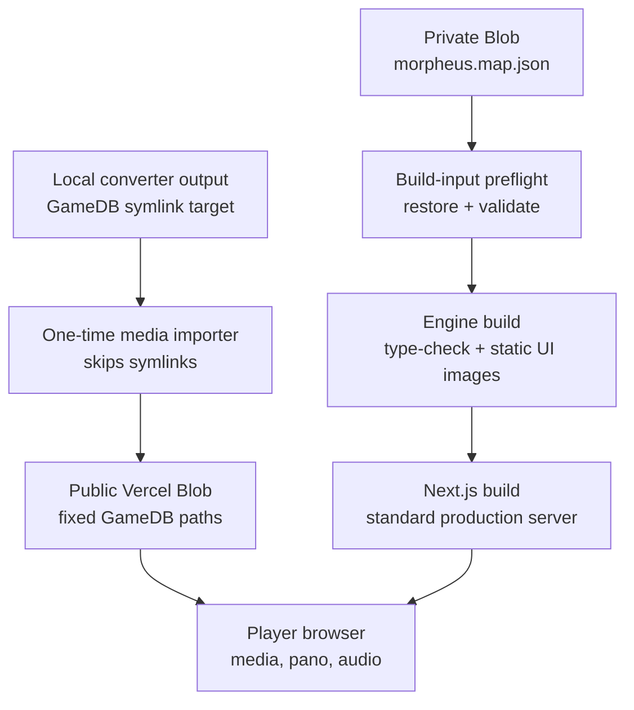

# Morpheus Vercel Blob Release - Plan

## Goal Capsule

- **Objective:** Release the current Morpheus Next.js player on Vercel while keeping the historical `GameDB` corpus and authored `morpheus.map.json` out of Git.
- **Scope:** A fixed public Vercel Blob origin for game media, a private Blob build input for the map, standard Next.js production hosting, and real hosted-runtime verification.
- **Authority:** The preserved game runtime and authored asset paths are the contract. Do not redesign gameplay, saves, or the archive to make deployment convenient.
- **Stop conditions:** Do not promote if the cloud build needs a local symlink, a representative media request fails, the production scene opens a game-control WebSocket, or Safari/iOS panorama animation cannot play directly from the public origin.
- **Out of scope:** A content-release manifest or pointer system, a production MCP/WebSocket broker, a new database or authentication layer, and concealing the full map from players.

---

## Product Contract

### Summary

Publish the existing media tree once to a fixed, public Blob origin and preserve each `GameDB/...` pathname.
Vercel builds obtain the ignored map from a private Blob before type-checking or bundling, while the app configures game media independently from the small engine UI-asset directory that remains in the Next build.

### Problem Frame

`packages/www/public/GameDB` is an ignored absolute local symlink to roughly 1.64 GB of converted historical media, and the 3.8 MB authored map is also ignored.
Neither input exists in a Git checkout that Vercel can build.
Current same-origin asset URLs hide this locally; production must make the data sources explicit without shipping the local testing broker or replacing the original runtime behavior.

### Requirements

- R1. Deploy `morpheus-next` as a standard Next.js application on Vercel using the repository workspace context and Node 24/Yarn Classic configuration, with map preflight before the engine or web package compiles.
- R2. Serve every existing game-media pathname below `GameDB/` from one fixed public Blob origin without committing or bundling the corpus into the web application.
- R3. Retrieve `morpheus.map.json` only during the build from private Blob storage, keep its credential server/build-only, and fail clearly if the map is unavailable or invalid.
- R4. Configure GameDB media separately from the existing `/morpheus-assets` static-image base so engine UI textures and historical game media both resolve correctly.
- R5. Do not expose the local MCP/game-control broker in preview or production; deployed scenes must not attempt a game-control WebSocket connection.
- R6. Preserve current local development behavior: the ignored local map and GameDB symlink continue to support the existing dev/test workflow without requiring Blob credentials.
- R7. Document the one-time media import, private map provisioning, Vercel variables, update caveat for stable Blob paths, and rollback/credential ownership.
- R8. Accept a release only after hosted browser proof covers title media, a deep-linked scene, panorama and animation playback, audio, a scene transition, local save/resume on the production hostname, and direct Blob HTTP behavior.

### Acceptance Examples

- AE1. Given a player opens the deployed title screen, when the intro begins, its MP4/WebM sources resolve from the public Blob origin and the player can continue into a new game.
- AE2. Given a player opens a known scene URL directly, when the scene renders, its panorama texture, controlled movie, and ambient audio load from `GameDB/...` at the Blob origin without cross-origin console errors.
- AE3. Given a Vercel build has no local map file, when the private build input is present, the build restores and validates it before compilation; when the input or credential is absent, the build fails before deployment.
- AE4. Given a player visits a preview or production scene with or without an `mcp` query parameter, when the stage mounts, the browser makes no `/api/game-control` WebSocket attempt.
- AE5. Given a player creates or resumes a save on the production domain, when they refresh or switch slots on that same hostname, the existing IndexedDB save behavior remains intact; saves are not expected to migrate across localhost, preview, or production origins.

### Scope Boundaries

#### Deferred to Follow-Up Work

- Versioned content releases, manifest pointers, and automatic rollback of changed media.
- Server-mediated map loading that avoids delivering the complete authored map to the browser.
- A production real-time control service, public MCP endpoint, or remote testing control plane.
- A new iOS media proxy if direct public-Blob playback fails on a real device.

#### Non-goals

- No migration of the Yarn v1/Lerna workspace.
- No replacement of browser-local saves with a server account system.
- No broad cleanup of legacy Firebase, server, or historical archive code unrelated to the Vercel player path.

---

## Planning Contract

### Key Technical Decisions

- KTD1. **Use one fixed public Vercel Blob media origin.** The uploader preserves `GameDB/...` keys and publishes direct browser-readable assets. `(session-settled: user-approved — chosen over a versioned content-release and pointer system: the first release should stay simple and flexible.)`
- KTD2. **Keep the authored map private as a cloud-build input, not a public runtime API.** A small build preflight restores the ignored file only when it is missing, validates its nonempty authored-map shape, and never exposes its token through a `NEXT_PUBLIC_` variable. It logs only source, byte count, and validation result. `(session-settled: user-approved — chosen over committing the map or treating it as a public deployment artifact: repository hygiene remains the priority.)`
- KTD3. **Separate GameDB origin from engine static-asset base.** `MORPHEUS_ASSET_BASE` continues to address the copied UI images under `/morpheus-assets`; a dedicated public GameDB origin resolves authored media paths. This avoids redirecting texture/icon lookups into a Blob store that intentionally contains only `GameDB`.
- KTD4. **Deploy with standard Next.js, not the custom local server.** The custom server and MCP broker remain local-only; a production gate disables their client hook so deployed players do not reconnect against an endpoint that does not exist. The Vercel build context remains the repository root because both the engine source and its generated static images are sibling workspace inputs.
- KTD5. **Use direct Blob media on iOS rather than a nonexistent production proxy.** The legacy iOS branch currently names an App Router route that is absent. The release changes this path only to direct media delivery, then requires real Safari/iOS playback proof; it does not add an untested Function proxy.
- KTD6. **Use stable media paths with a bounded-cache operational policy.** This release intentionally does not add content versions. The import process sets a deliberate finite cache lifetime and the runbook requires a fresh-session/in-game check after any overwrite; a successful upload alone is not release proof.

### High-Level Technical Design

### Assumptions

- The historical media can be publicly readable because the current player already fetches it directly; a public Blob URL is not an access-control boundary.
- The Vercel project is configured with the repository as its build context, so the linked `packages/morpheus` source and generated engine UI images are available.
- A Vercel owner can create one public media store and one private map store, attach the private-store token to build environments, and set a spend notification before launch.
- The map’s private storage protects the source repository and build logs, not its contents from players, because the current client imports it to resolve scenes.

### Sequencing

Implement the map preflight before configuring Vercel because both the engine type/build and the web build import it.
Build the engine static-image output before the web package evaluates `next.config.js`.
Create the store and import the corpus only after the uploader can prove its inventory and URL shape locally.
Treat preview browser verification as the gate before adding a production domain or promoting the deployment.

### Deferred Implementation Notes

- Choose the exact Blob SDK versus CLI wrapper while implementing the narrow operation scripts; both must retain the same input, secret, and no-symlink contract.
- Select the finite public-media cache lifetime from expected correction frequency and observed traffic; record it in the operator documentation rather than introducing a release-pointer mechanism.

---

## Implementation Units

### U1. Separate and test GameDB URL resolution

- **Goal:** Route every authored GameDB media request to the public Blob origin while leaving `/morpheus-assets` responsible for copied engine UI files.
- **Requirements:** R2, R4, R6. Covers AE1 and AE2.
- **Dependencies:** None.
- **Files:** `packages/www/next.config.js`, `packages/www/src/service/gamedb.ts`, `packages/www/src/service/gamedb.test.ts`, `packages/www/src/morpheus-app/runtime.ts`, `packages/www/src/app/providers.tsx`, `packages/morpheus/client/js/service/gamedb.ts`, `packages/morpheus/client/js/service/gamedb.test.ts`.
- **Approach:** Introduce one explicitly named public GameDB-origin configuration value whose value is the parent of `GameDB`, normalize it once, and apply it to both the title-screen helper and the engine helper. Initialize the engine helper from the App Router runtime without changing local default paths. Retain the existing static-image asset base unchanged. Remove the production-dead iOS proxy path so pano-animation URLs use the same direct GameDB resolver.
- **Patterns to follow:** `packages/morpheus/client/js/morpheus/assets/index.ts` for path/base normalization and `packages/www/vitest.config.ts` for testing sibling engine source from the web workspace.
- **Test scenarios:**
  - A public origin with or without a trailing slash plus `GameDB/Deck1/introMOV.webm` produces exactly one `GameDB` path segment.
  - A title texture, panorama PNG, MP4/WebM movie, and MP3/Ogg/AAC audio each preserve their authored relative path and extension.
  - An authored filename containing `#` remains URL-encoded.
  - The absent public origin preserves current same-origin development behavior.
  - The iOS panorama-animation path uses the configured direct origin rather than `/api/brokeniOSProxy`.
- **Verification:** Focused web and engine tests prove URL shape; a local scene still resolves against the ignored symlink with no Blob variables configured.

### U2. Add minimal Blob import and map build-input tooling

- **Goal:** Make cloud builds independent of local ignored paths while keeping the first media release free of manifests and release pointers.
- **Requirements:** R2, R3, R6, R7. Covers AE3.
- **Dependencies:** U1.
- **Files:** `packages/www/package.json`, `packages/www/vitest.config.ts`, `packages/www/scripts/upload-gamedb.mjs`, `packages/www/scripts/gamedb-paths.mjs`, `packages/www/scripts/gamedb-paths.test.mjs`, `packages/morpheus/package.json`, `packages/morpheus/scripts/prepare-morpheus-map.mjs`, `packages/morpheus/client/js/service/morpheus.map.json`.
- **Approach:** Add one narrow operator importer that resolves the local converter target, accepts regular files only, rejects symlink/path escapes, preserves case and `GameDB/...` relative keys, assigns the correct media content type/cache policy, and reports expected, discovered, uploaded, skipped, collision, and error counts. Record target ETags after import. Add a build preflight owned by the engine package that leaves a valid local map alone but, for a cloud build without it, reads the private Blob input with a server-only token, writes the expected ignored path, and rejects absent, empty, malformed, or structurally invalid map data before TypeScript or Next begins. It must never print the private URL, token, or map body. Wire that preflight into every engine build/type path; make the Vercel build run the engine static-image build before evaluating `next.config.js`.
- **Patterns to follow:** `packages/morpheus/scripts/build-esm.mjs` for small ESM build scripts, `packages/www/vitest.config.ts` for focused script-test discovery, and `packages/www/.gitignore` / `packages/morpheus/.gitignore` for intentional local inputs.
- **Test scenarios:**
  - A fixture tree with a self-referential symlink imports only regular files and terminates.
  - Imported keys retain directory case and begin with one `GameDB/` prefix.
  - A missing private-map credential, unavailable object, empty response, invalid JSON, or JSON that is not a nonempty authored-map array stops the build before compiler output.
  - A valid existing local map allows local tests/builds without Blob credentials.
  - No public client variable or generated output contains the private Blob token.
- **Verification:** A clean checkout-style engine-plus-web build succeeds after the preflight fetches the map and generates engine UI assets; logs identify only map source, byte count, and validation; import inventory, ETags, and representative Blob URLs match the local converter source.

### U3. Keep game control local-only in deployed scenes

- **Goal:** Prevent every preview/production player from opening and retrying a nonexistent game-control WebSocket.
- **Requirements:** R1, R5, R6. Covers AE4.
- **Dependencies:** None.
- **Files:** `packages/www/src/app/scene/stage-shell.tsx`, `packages/www/src/morpheus-app/hooks/useGameControl.ts`, `packages/www/src/morpheus-app/hooks/useGameControl.test.ts`, `packages/www/src/app/scene/stage-shell.test.tsx`.
- **Approach:** Make game-control activation an explicit local-development capability rather than a default-on scene behavior. Preserve named-session behavior in the documented custom local server path, but omit all connection and reconnect work in standard deployed Next runtime.
- **Patterns to follow:** `packages/www/server.ts` and `packages/www/AGENTS.md` define the broker’s local-only boundary; `packages/www/src/morpheus-app/hooks/useGameControl.test.ts` covers connection lifecycle behavior.
- **Test scenarios:**
  - A standard production scene mounts without constructing a WebSocket, including when an `mcp` query parameter is present.
  - Local custom-server development with a named session preserves browser/MCP pairing.
  - An enabled local connection keeps the existing reconnect and callback behavior.
- **Verification:** Preview browser network logs show no `/api/game-control` request; a named local MCP session continues to perform a browser-authoritative hotspot click.

### U4. Configure Vercel and document promotion proof

- **Goal:** Give operators one repeatable project setup and a launch gate that verifies the hosted game rather than trusting a green deployment record.
- **Requirements:** R1, R7, R8. Covers AE1, AE2, and AE5.
- **Dependencies:** U1, U2, U3.
- **Files:** `packages/www/README.md`, `packages/www/AGENTS.md`, `docs/release/morpheus-vercel.md`.
- **Approach:** Document the Vercel project’s repository build context, Node 24/Yarn Classic engine-before-web build order, public GameDB origin, private map credential, preview/production variable separation, and media-update cache caveat. Define an operator runbook that creates/links the stores, imports media, proves a preview, promotes only after browser checks, records the active domain/store ownership, and rotates the map token when access changes. Keep the full `GameDB` corpus and map out of the deployment repository. Name the Vercel-project, public-store, private-map/token, and emergency-media-correction owners; set a paid-plan spend threshold/alert before launch and review transfer, edge-request, and cache-miss-origin usage after launch. Define rollback honestly: code can revert to the prior Vercel deployment, while a stable-path media overwrite requires restoring the retained source object, recording old/new ETags, and waiting for the documented cache window.
- **Patterns to follow:** `packages/www/README.md` for local-versus-production runtime distinctions and root `AGENTS.md` for supported commands and operational scope.
- **Test expectation:** none — this unit documents and configures a verified operating path; its proof is the full hosted verification contract below.
- **Verification:** A Vercel Preview builds from Git without local symlinks, a production deployment uses the same environment shape, and the operator can follow the runbook without relying on an unrecorded machine path.

---

## System-Wide Impact

- **Data lifecycle:** Game media moves from an untracked local filesystem dependency to public object storage; authored map data moves from an untracked local build dependency to private object storage.
- **Privacy and authority:** The map credential is build-only and must never be exposed as a public environment variable. Public media is intentionally readable by URL.
- **Player continuity:** Saves remain IndexedDB scoped to each browser origin. Production validation must create and resume saves on the final hostname; no cross-origin migration is implied.
- **Agent parity:** The development MCP remains useful locally but is intentionally unavailable in hosted environments. This avoids making a test broker a public, unauthenticated runtime surface.

---

## Risks & Dependencies

| Risk or dependency | Mitigation and release gate |
| --- | --- |
| Cloud build cannot see ignored map or generated engine images | Run map preflight before all map consumers; use repository build context and explicit engine/static-asset build order. |
| Blob media URL is correct but unusable by video/WebGL | Test representative content type, CORS/canvas behavior, byte-range `206` response, `Accept-Ranges`, `ETag`, and actual in-game playback from Preview. |
| Stable Blob paths show stale content after an overwrite | Use a finite documented cache policy; verify the exact URL in a fresh private session and in the game before declaring an update live. |
| A stable-path overwrite needs rollback | Retain the last known-good local source and record the object pathname/ETag before upload; code can roll back through Vercel, while media restoration requires re-upload plus cache-window verification. |
| iOS legacy proxy behavior has no App Router implementation | Use direct Blob delivery and test physical Safari/iOS; stop promotion for failed panorama animation rather than adding an unproven proxy. |
| WebSocket hook retries in production | Gate game-control startup to local development and assert that hosted scene network logs contain no broker connection. |
| Vercel Blob cost grows with media views | Enable spending notifications before public launch and monitor Blob data-transfer usage; storage is trivial compared with video egress. |

---

## Documentation and Operational Notes

- The public media store is an archive delivery surface. Upload only rights-cleared converted content and preserve original `GameDB` path casing.
- Store ownership, Vercel project, public origin, map input path, credential rotation owner, emergency correction owner, cache policy, last-known-good media source location, and spend-alert threshold belong in `docs/release/morpheus-vercel.md`.
- A media replacement is not proven by a CLI success line. Verify the exact Blob URL from a fresh browser context and replay the affected game scene.
- Avoid presenting preview-host saves as transferable production saves; a custom production domain establishes another IndexedDB origin.

---

## Verification Contract

| Gate | Applies to | Evidence of completion |
| --- | --- | --- |
| Focused asset and control tests | U1, U2, U3 | `yarn workspace morpheus-next test` covers new URL, map-preflight, and production control-gate cases. |
| Engine behavior tests | U1 | `yarn workspace @soapbubble/morpheus-client test` retains asset-resolution and runtime behavior coverage. |
| Type and production build | U1-U3 | With Node 24 selected, the engine build runs map preflight and produces static images before `yarn workspace morpheus-next build` succeeds from a clean checkout-style workspace. |
| Preview HTTP proof | U2, U4 | Direct Blob responses for a PNG, MP4/WebM, and AAC/MP3/Ogg audio have the expected content type; a seekable video returns `206` and `Accept-Ranges`; asset URLs have usable cross-origin headers. |
| Preview browser smoke | U1-U4 | Desktop browser completes title intro, deep-linked scene, panorama rotation, pano animation, audio, controlled movie, authored hotspot transition, and has no Blob/WebSocket console failures. Record the preview URL, commit, Blob origin, map object identifier/ETag, test scene IDs, browser, and evidence capture. |
| Mobile browser smoke | U1, U4 | Physical Safari/iOS replays a panorama animation from the direct origin; failure blocks production promotion. |
| Production smoke | U4 | On the final domain, repeat preview media/network checks, create/resume a save, switch slots, replay the primary media/transition path, and inspect network/console after deployment. Record the deployment URL, browser/device, timestamp, and evidence capture. |

---

## Definition of Done

- U1 resolves all current GameDB media through one public origin without changing the existing engine static-image base or breaking local asset paths.
- U2 imports the corpus without symlink recursion and lets Vercel obtain a valid ignored map with no browser-visible credential.
- U3 leaves local MCP testing functional but creates no hosted game-control WebSocket activity.
- U4 records enough configuration and recovery context for another operator to repeat the release without the original workstation.
- The full Verification Contract passes for a Vercel Preview and the final production domain.
- Browser and physical iOS proof show media delivery preserves the intended runtime behavior; no unsupported download, payment, or legacy backend path is reintroduced.
- The final diff contains no abandoned uploader, proxy, or deployment experiments outside these units.

---

## Sources and Research

- `packages/www/next.config.js`, `packages/www/src/morpheus-app/runtime.ts`, `packages/www/src/service/gamedb.ts`, and `packages/morpheus/client/js/service/gamedb.ts` establish the currently separate static/UI and GameDB asset seams.
- `packages/morpheus/client/js/service/morpheus.map.ts`, `packages/morpheus/client/js/service/scene.ts`, and `packages/www/src/app/providers.tsx` show why the ignored map is required by both SSR and browser scene resolution.
- `packages/www/server.ts`, `packages/www/README.md`, `packages/www/AGENTS.md`, `packages/www/src/app/scene/stage-shell.tsx`, and `packages/www/src/morpheus-app/hooks/useGameControl.ts` establish that the broker is local-only while the current scene shell still enables it.
- [Vercel Blob overview](https://vercel.com/docs/vercel-blob), [Blob pricing](https://vercel.com/docs/vercel-blob/usage-and-pricing), [Blob CLI](https://vercel.com/docs/cli/blob), and [Vercel monorepos](https://vercel.com/docs/monorepos) inform store access, media delivery, and build-context decisions.
